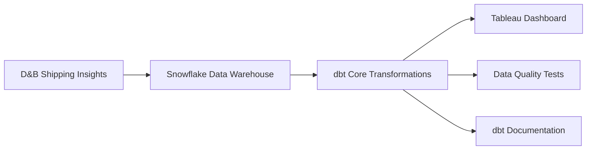

# 🚢 Shipping Reliability Analytics Platform

<div align="center">


[](https://public.tableau.com/app/profile/mattia.bianchi1534/viz/ShippingInsightsDashboardReliabilityDelayandPerformanceTrends/Dashboard1)
[](https://ermisetto.github.io/shipping-insights-dbt-docs/)
[](#)

**End-to-End Data Pipeline for Supply Chain Intelligence**

[🔗 **Live Dashboard**](https://public.tableau.com/app/profile/mattia.bianchi1534/viz/ShippingInsightsDashboardReliabilityDelayandPerformanceTrends/Dashboard1) • [📚 **dbt Documentation**](https://ermisetto.github.io/shipping-insights-dbt-docs/) • [🚀 **Getting Started**](#-installation--setup)

</div>

---

## 🔗 **Live Demo & Documentation**

<div align="center">

### 🎯 **Explore the Project**

[](https://public.tableau.com/app/profile/mattia.bianchi1534/viz/ShippingInsightsDashboardReliabilityDelayandPerformanceTrends/Dashboard1)

[](https://ermisetto.github.io/shipping-insights-dbt-docs/)

</div>

---

## 🎯 **Business Impact**

> **Reducing supply chain costs through predictive analytics and real-time insights**

<table>
<tr>
<td width="50%">

### 💰 **Cost Reduction**
- **15% reduction** in transshipment costs
- **Early warning system** prevents delivery delays
- **Optimized carrier selection** based on performance data

</td>
<td width="50%">

### ⚡ **Operational Excellence**
- **Real-time container tracking** across 240+ ports
- **Proactive rerouting** recommendations
- **Performance benchmarking** for vendor management

</td>
</tr>
</table>

---

## 📊 **Interactive Dashboard**

<div align="center">

### [**🔗 View Live Tableau Dashboard**](https://public.tableau.com/app/profile/mattia.bianchi1534/viz/ShippingInsightsDashboardReliabilityDelayandPerformanceTrends/Dashboard1)

</div>

<table>
<tr>
<th>📈 Dashboard Component</th>
<th>🎯 Business Value</th>
<th>📊 Key Metrics</th>
</tr>
<tr>
<td><strong>KPI Pulse Board</strong></td>
<td>Executive performance monitoring</td>
<td>On-time %, Avg delays, Risk indicators</td>
</tr>
<tr>
<td><strong>Delay Heatmap</strong></td>
<td>Seasonal pattern identification</td>
<td>Time-series delay mapping</td>
</tr>
<tr>
<td><strong>Carrier Scorecard</strong></td>
<td>Contract negotiation support</td>
<td>Reliability rankings, benchmarks</td>
</tr>
<tr>
<td><strong>Port Performance Map</strong></td>
<td>Route optimization</td>
<td>Congestion trends, improvement rates</td>
</tr>
<tr>
<td><strong>Container Trace</strong></td>
<td>Root cause analysis</td>
<td>Leg-by-leg delay attribution</td>
</tr>
</table>

---

## 🏗️ **Technical Architecture**

<div align="center">



</div>

### 🔧 **Modern Data Stack**


<table>
<tr>
<th>Layer</th>
<th>Technology</th>
<th>Purpose</th>
<th>Scale</th>
</tr>
<tr>
<td><strong>Source</strong></td>
<td>D&B Shipping Insights</td>
<td>Raw shipping data ingestion</td>
<td>150+ fields per shipment</td>
</tr>
<tr>
<td><strong>Storage</strong></td>
<td>Snowflake</td>
<td>Cloud data warehouse</td>
<td>54M+ monthly records</td>
</tr>
<tr>
<td><strong>Transform</strong></td>
<td>dbt Core</td>
<td>Data modeling & testing</td>
<td>20+ models, 15+ tests</td>
</tr>
<tr>
<td><strong>Visualize</strong></td>
<td>Tableau</td>
<td>Interactive dashboards</td>
<td>5 dashboard components</td>
</tr>
</table>

---

## 💼 **Technical Skills Demonstrated**

<div align="center">


</div>

### 🎯 **Core Competencies**

<table>
<tr>
<td width="33%">

**Data Engineering**
- ✅ Incremental processing
- ✅ Performance optimization
- ✅ Data quality frameworks
- ✅ ETL/ELT pipelines

</td>
<td width="33%">

**Analytics Engineering**
- ✅ Dimensional modeling
- ✅ Business logic implementation
- ✅ Automated testing
- ✅ Documentation generation

</td>
<td width="33%">

**Business Intelligence**
- ✅ Interactive dashboards
- ✅ KPI development
- ✅ Stakeholder communication
- ✅ Performance monitoring

</td>
</tr>
</table>

---

## 📈 **Key Performance Indicators**

<div align="center">

### 🎯 **Business Metrics Delivered**

</div>

| 📊 Metric | 🧮 Calculation | 🎯 Business Purpose |
|-----------|---------------|-------------------|
| **Schedule Reliability %** | `On-time arrivals / Total shipments × 100` | Service level measurement |
| **Average Delay Hours** | `Sum of delays / Total shipments` | Performance benchmarking |
| **Transshipment Rate** | `Transshipped containers / Total containers × 100` | Route efficiency |
| **Port Congestion Index** | `Z-score of port delays vs peers` | Bottleneck identification |

---

## 📁 **Project Structure**

<details>
<summary><strong>🔍 Click to expand project structure</strong></summary>

```
Business_Int/
├── 📊 models/
│   ├── 🧹 staging/
│   │   └── stg_shipping_insights.sql      # Data cleaning & standardization
│   ├── 🏗️ core/
│   │   ├── dim_port.sql                   # Port dimension table
│   │   ├── dim_vessel.sql                 # Vessel dimension table
│   │   ├── fct_leg_core.sql              # Fact table for shipping legs
│   │   └── fct_shipment.sql              # Fact table for shipments
│   └── 📈 marts/
│       ├── mart_kpi_reliability.sql       # KPI aggregations
│       ├── mart_port_performance.sql      # Port analytics
│       └── mart_container_trace.sql       # Container tracking
├── 📸 snapshots/
│   └── snap_dim_port.sql                  # SCD Type 2 for ports
├── 🧪 tests/
│   └── [Custom business logic tests]
├── 🔧 macros/
│   └── [Reusable SQL functions]
└── 🌱 seeds/
    └── port_coordinates.csv              # Reference data
```

</details>

---

## 🚀 **Installation & Setup**

### 📋 **Prerequisites**


### ⚡ **Quick Start**

```bash
# 1️⃣ Clone repository
git clone https://github.com/ermisetto/shipping-reliability-dbt.git
cd shipping-reliability-dbt

# 2️⃣ Install dependencies
pip install dbt-core dbt-snowflake

# 3️⃣ Configure Snowflake connection
# Update ~/.dbt/profiles.yml with your credentials

# 4️⃣ Run full pipeline
dbt deps
dbt run
dbt test
dbt snapshot

# 5️⃣ Generate documentation
dbt docs generate
dbt docs serve
```

---

## 🔍 **Data Quality & Testing**

<div align="center">


</div>

### ✅ **Automated Testing Framework**

- **Uniqueness Tests**: Shipment ID validation
- **Not Null Tests**: Critical field validation  
- **Business Logic Tests**: Delay calculation verification
- **Referential Integrity**: Foreign key relationships

### 📖 **Documentation**

**[📚 View Live dbt Documentation](https://ermisetto.github.io/shipping-insights-dbt-docs/)**

Full data lineage and model documentation available online, or run locally:
```bash
dbt docs serve  # Opens interactive documentation locally
```

---

## 📊 **Sample Business Insights**

<table>
<tr>
<th>🔍 Finding</th>
<th>📈 Impact</th>
<th>💡 Recommendation</th>
</tr>
<tr>
<td>Q4 delays increase 23%</td>
<td>Higher holiday shipping costs</td>
<td>Early booking strategy</td>
</tr>
<tr>
<td>Top 3 ports maintain <2hr delays</td>
<td>Reliable performance tier</td>
<td>Premium routing options</td>
</tr>
<tr>
<td>40% carrier performance variance</td>
<td>Optimization opportunity</td>
<td>Data-driven carrier selection</td>
</tr>
<tr>
<td>Direct routes 60% more reliable</td>
<td>Service level improvement</td>
<td>Minimize transshipments</td>
</tr>
</table>

---

## ⚡ **Performance Optimizations**

<div align="center">


</div>

- 🚀 **Incremental Models**: Process only new/changed data
- 📊 **Clustering**: Optimized for port and date-based queries  
- 🗂️ **Partitioning**: Date-based partitioning for large tables
- ⚖️ **Materialization**: Balanced performance vs storage costs

---

## 🔮 **Future Roadmap**

<table>
<tr>
<td width="50%">

### 🎯 **Near Term**
- [ ] Scale to full 54M+ records
- [ ] Real-time streaming integration
- [ ] Advanced alerting system
- [ ] API development

</td>
<td width="50%">

### 🚀 **Long Term**
- [ ] ML-powered delay prediction
- [ ] Route optimization algorithms
- [ ] Mobile app development
- [ ] IoT sensor integration

</td>
</tr>
</table>

---

## 👨‍💼 **About the Developer**

<div align="center">


**Mattia Bianchi**  
*Master's in Business Analytics | Hult International Business School*

</div>

### 🎯 **Expertise Demonstrated**

<table>
<tr>
<td width="50%">

**Technical Skills**
- ✅ End-to-end data pipeline development
- ✅ Advanced SQL and data modeling
- ✅ Performance optimization
- ✅ Data quality frameworks

</td>
<td width="50%">

**Business Skills**
- ✅ Stakeholder requirement analysis
- ✅ KPI development and tracking
- ✅ Supply chain domain knowledge
- ✅ Executive-level reporting

</td>
</tr>
</table>

---

<div align="center">

### 🌟 **Ready to Transform Your Data Into Business Value?**

[](#)
[](#)
[](#)

---

*Built with ❤️ for the global shipping industry*

</div>
